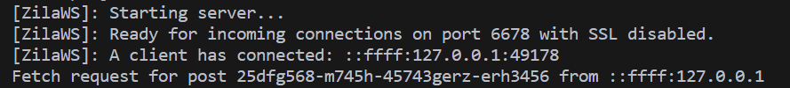
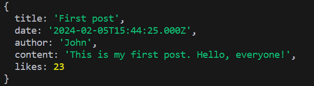

import Tabs from "@theme/Tabs";
import TabItem from "@theme/TabItem";
import OR from "@site/src/components/OR";

# Waiters

ZilaWS has a unique function called `waiter`. Waiters (as their name suggests) can be awaited.
They resolve when a [MessageHandler](./client-api/recieving-data#waiting-for-data.mdx) on the other side of the connection resolves or returns thus making it perfect for retrieving data.
However if the client or server does not respond in time, waiters will resolve as *undefined*.

- Regular `waiter`s wait for a response for the time specified by the `maxWaiterTime` property.
    - On the *server* side this is a property of the *server* object.
    - On the *client* side this is a property of the *client* object.
- `waiterTimeout`s wait for a response for the time specified by the `maxWaitingTime` parameter in miliseconds.

## Parameters

* `identifier`: The name of the [MessageHandler](./client-api/recieving-data#waiting-for-data.mdx) on the other side of the connection. 
* `maxWaitingTime`: This paramater overrides the maximum waiting time for the corresponding `waiter` or `broadcastWaiter`. The value is in miliseconds.
* `...data`: A waiter (or a send) can be given any number of any data.


## Usage

<Tabs>
<TabItem value="Server" label="Server-side">
### Waiter

```ts
socket.waiter<T>(identifier: string, ...data: any[]): Promise<T | undefined>
```

```ts
socket.waiterTimeout<T>(identifier: string, maxWaitingTime: number, ...data: any[]): Promise<T | undefined>
```

<OR/>

```ts
server.waiter<T>(socket: ZilaClient, identifier: string, ...data: any[]): Promise<T | undefined>
```

```ts
server.waiterTimeout<T>(socket: ZilaClient, identifier: string, maxWaitingTime: number, ...data: any[]): Promise<T | undefined>
```

### BroadcastWaiter

These functions only return values from those clients which respond in time.

```ts
server.broadcastWaiter<T>(identifier: string, ...data: any[]): Promise<Array<T>>
```

```ts
server.broadcastWaiterTimeout<T>(identifier: string, maxWaiterTime: number, ...data: any[]): Promise<Array<T>>
```

</TabItem>
<TabItem value="Client" label="Client-side">

### Waiter

```ts
client.waiter<T>(identifier: string, ...data: any[]): Promise<T | undefined>
```

<OR/>

```ts
client.waiterTimeout<T>(identifier: string, maxWaitingTime: number, ...data: any[]): Promise<T | undefined>
```

</TabItem>
</Tabs>

## Example

This example shows how a very basic blog should use ZilaWS to request a post's details from the clientside.

<Tabs>
<TabItem value="Server" label="Server-side">

```ts
import { ZilaServer } from "zilaws-server";

interface IPost {
    title: string;
    date: Date;
    author: string;
    content: string;
    likes: number;
}

//Setting up the server
const server = new ZilaServer({
    port: 6678,
    logger: true
});

function fetchPost(id: string): Promise<IPost> {
    return new Promise((resolve) => {
        //In reality this is the part where you'd fetch data from your database.
        resolve({
            title: "First post",
            date: new Date(2024, 1, 5, 16, 44, 25),
            author: "John",
            content: "This is my first post. Hello, everyone!",
            likes: 23
        });
    });
}

//Set up a MessageHandler
server.setMessageHandler("GetPostById", async (clSocket, postId: string) => {
    console.log(`Fetch request for post ${postId} from ${clSocket.ip}`);
    return await fetchPost(postId);
});
```

Console output:


</TabItem>
<TabItem value="Client" label="Client-side">
```ts
import { connectTo } from "zilaws-client";

interface IPost {
    title: string;
    date: Date;
    author: string;
    content: string;
    likes: number;
}

//Connecting to the server
const client = await connectTo("ws://127.0.0.1:6678", (error) => {
    console.error("Error happened: " + error);
});

//This waiter calls a MessageHandler on the server side which's name is GetPostById and passes it the UID string. 
const post = await client.waiter<IPost>("GetPostById", "25dfg568-m745h-45743gerz-erh3456");

console.log(post);
```

This is the output:



</TabItem>
</Tabs>

## Playground

<embed src='https://stackblitz.com/edit/stackblitz-starters-4y6s2e?ctl=1&embed=1&file=readme.md&view=editor' style={{marginInline: "auto", display: "block", width: "80%", height: "600px"}}></embed>